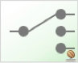
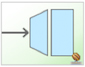

# Spring Integration Flow Visualizer

**Currently supported nodes are**

-  Channel
-  Router
-  Gateway
-  Chain
-  WS:Inbound-Gateway
-  Service-Activator

**Instruction to use**

1. Clone the project in your local machine
2. Run the [index.html](index.html)
3. Provide URL of your Spring Integrations projects integration REST API URL
4. Hit the *Load Data* button

**Note**

- You can drag nodes around for your custom visualization
- Hover on node will show you more detail about the node
- Hover on line / path will highlight the path and both From & To nodes
- You can set timer to reload the data at specific interval